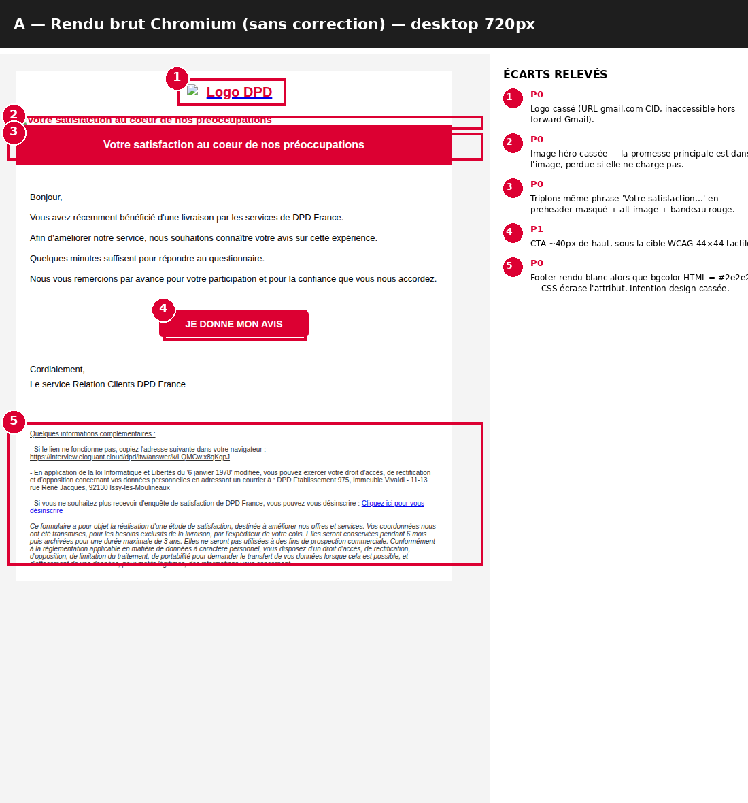
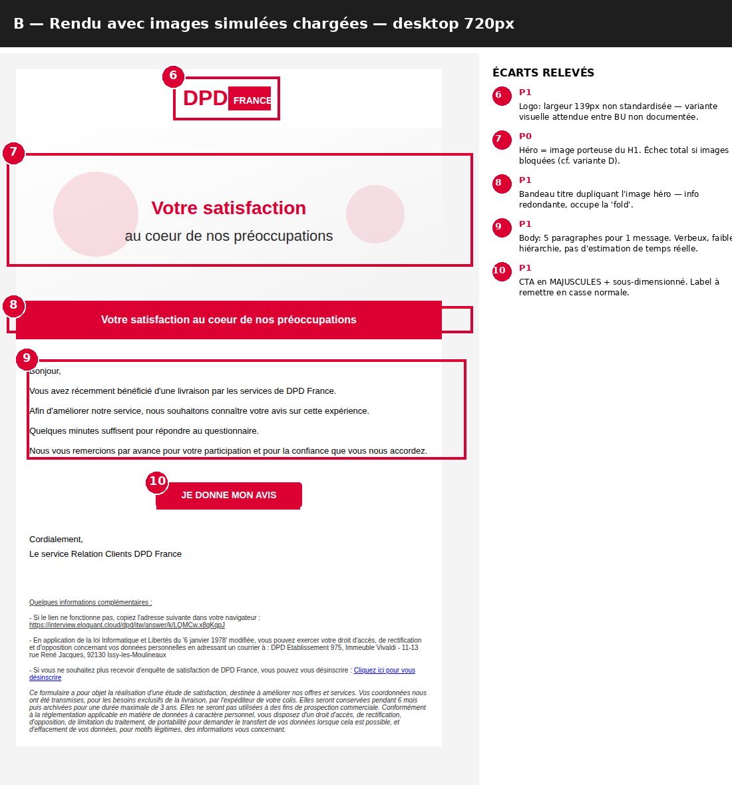
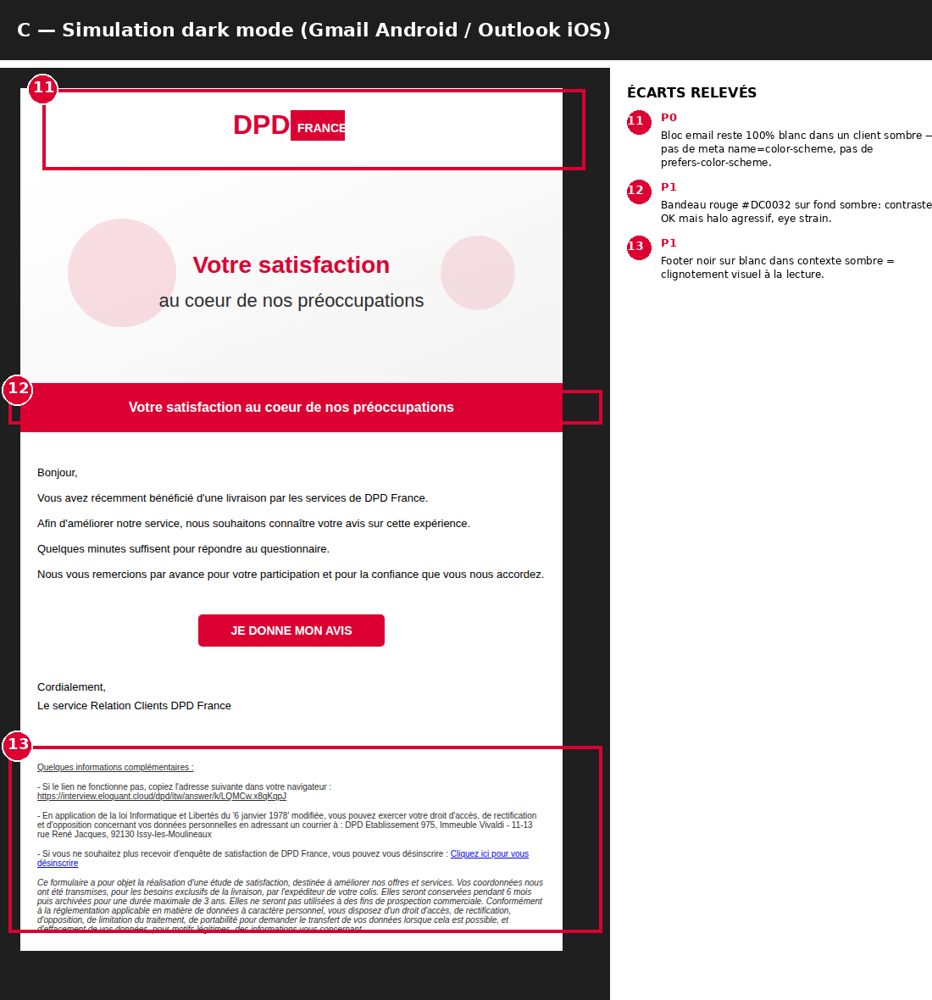
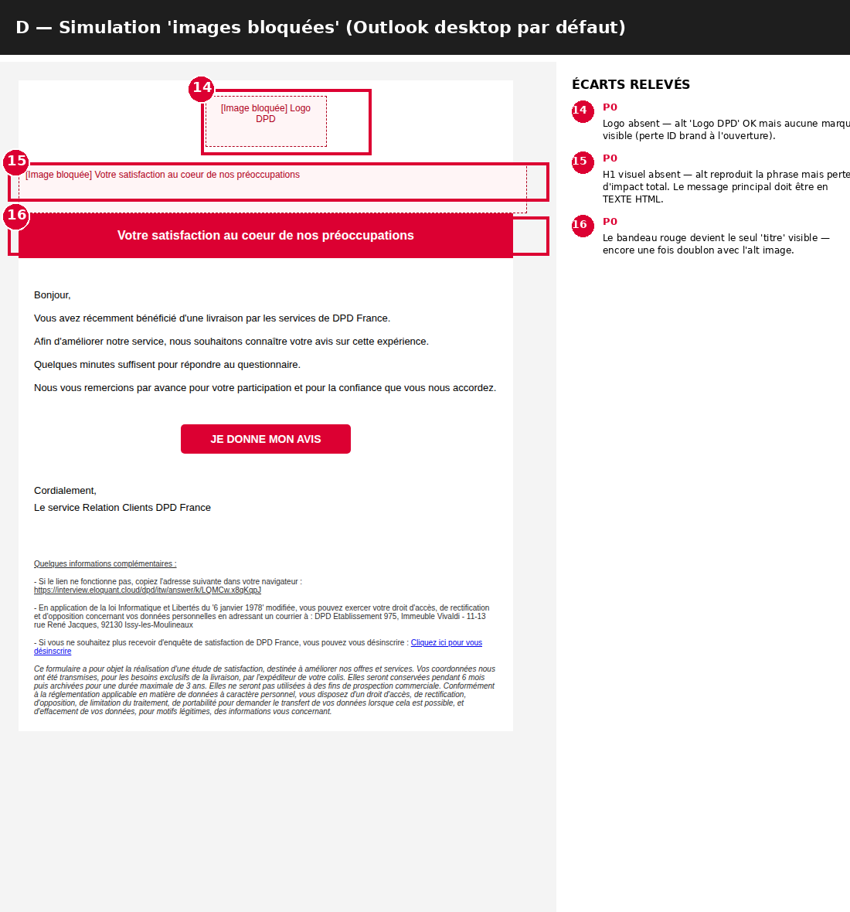
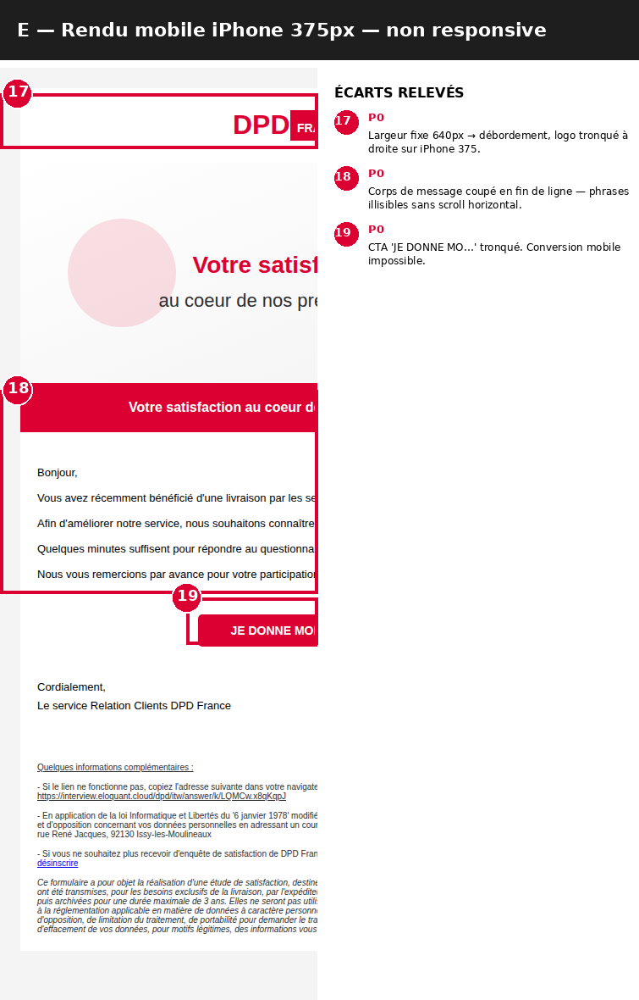

# AUDIT EMAIL CRM — Geopost / DPD France
## Email POC #1 — Enquête satisfaction post-livraison

**Date** : 11 mai 2026
**Auditeur** : Geopost Lead CRM V1 (orchestrateur) — exécution agent **01 Audit V1**
**Source auditée** : `_brief/sample_existing_dpd_email.html` (124 lignes, export Gmail forward)
**Cadre brief** : Templates Revamp Project — RFP 4 mai 2026 / deadline 22 mai 2026
**Périmètre** : 1 email · 1 BU (DPD FR) · langue FR · plateforme imagino (CDP)
**Hypothèse traçable** : *DPD FR n'apparaît pas dans la liste explicite des BUs du brief (BRT IT / DPD CH / DPD CZ / DPD SK). À confirmer côté Geopost si DPD FR est dans le scope revamp Phase 2.*

---

## 0. Méthode

L'email a été rendu en **5 environnements simulés** via Chromium headless, pour confronter le code aux conditions réelles de réception :

| Variante | Environnement | Finalité audit |
|---|---|---|
| **A** | Desktop 720px, rendu brut (sans correction) | Constater l'état réel à l'ouverture hors contexte Gmail forward |
| **B** | Desktop 720px, images simulées chargées | Auditer le design « cas idéal » |
| **C** | Dark mode (Gmail Android / Outlook iOS) | Auditer robustesse couleurs en mode sombre |
| **D** | Images bloquées (Outlook desktop par défaut) | Auditer la dégradation graceful |
| **E** | Mobile iPhone 375px | Auditer la responsivité |

> Captures complètes annotées : `audit_outputs/annotated/` · sources rendues : `audit_outputs/screens/` · variantes HTML : `audit_outputs/variants/`.

---

## 1. Synthèse exécutive (5 puces, décision)

- **[P0] L'email n'est pas responsive.** Largeur fixe `width="640"` sans `@media` ni `meta viewport`. Sur iPhone 375px, **CTA tronqué → conversion mobile impossible** (variante E, écart #19). Compte tenu de ~60% d'ouvertures mobile, c'est l'écart le plus coûteux du POC.
- **[P0] Le message principal est porté par une image.** L'image héro « Votre satisfaction au cœur de nos préoccupations » contient le H1 en pixels. En Outlook desktop par défaut (images bloquées), **toute la promesse de marque disparaît à l'ouverture** (variante D, écart #15). Combiné à des URL d'images pointant vers `mail.google.com` (CID Gmail), même un client moderne sans blocage ne les affiche pas (variante A, écarts #1–#2).
- **[P0] Aucune robustesse Outlook.** `<head>` vide (pas de doctype XHTML, pas de charset, pas de title), `<tbody>` orphelin sans `<table>` racine, aucun commentaire conditionnel mso, aucune table `role="presentation"`, bouton CTA non bulletproof (border-radius CSS isolé). Le brief §2 cite explicitement Outlook legacy comme issue à résoudre.
- **[P1] Triplon éditorial.** La même phrase « Votre satisfaction au cœur de nos préoccupations » apparaît **3 fois** : preheader masqué (texte blanc sur blanc, l.15), alt de l'image héro (l.26), bandeau rouge titre (l.34). Aucune des 3 occurrences n'apporte d'info différente → preheader gaspillé, hiérarchie illisible (variante A, écart #3).
- **[P1] UX writing verbeux + CTA sous-dimensionné.** 5 paragraphes pour porter un message qui tient en 2. CTA `JE DONNE MON AVIS` en MAJUSCULES, hauteur ~40px (sous la cible WCAG 44×44 tactile). Pas d'estimation de temps réelle (« quelques minutes » → quantifier : *« 2 minutes »*).

---

## 2. Captures annotées — preuves visuelles

### A. Rendu brut Chromium (sans correction) — desktop 720px



**Diagnostic** : on voit ici **ce que voit réellement** un destinataire qui ouvre l'email aujourd'hui hors du forward Gmail d'origine. Logo et héro cassés (URL CID Gmail inaccessibles), preheader masqué visible en haut sous forme de bande blanche (mais texte présent en source), footer rendu **blanc** alors que l'attribut `bgcolor="#2e2e2f"` indique une intention de gris foncé — preuve d'un conflit CSS inline vs. attribut HTML.

| # | Sévérité | Constat |
|---|---|---|
| 1 | P0 | Logo cassé — URL `mail.google.com/...attid=0.0.1...` (CID Gmail). |
| 2 | P0 | Image héro cassée — même cause. |
| 3 | P0 | Triplon du slogan (preheader/alt/bandeau). |
| 4 | P1 | CTA ~40px < cible tactile 44×44. |
| 5 | P0 | Footer rendu blanc — `style="background-color:#ffffff"` écrase `bgcolor="#2e2e2f"`. |

### B. Rendu avec images chargées — desktop 720px



**Diagnostic** : même avec images chargées, la composition reste **faible** : pas de hiérarchie visuelle au-delà du bandeau rouge, body verbeux, CTA petit. La double présence du slogan (héro + bandeau) consomme la moitié de la « fold » sans information utile.

| # | Sévérité | Constat |
|---|---|---|
| 6 | P1 | Logo largeur 139px non standardisée. |
| 7 | P0 | Héro porteur du H1 en image (échec si bloquée). |
| 8 | P1 | Bandeau dupliquant l'image héro. |
| 9 | P1 | Body 5 paragraphes / 1 message. |
| 10 | P1 | CTA MAJUSCULES + sous-dimensionné. |

### C. Simulation dark mode (Gmail Android / Outlook iOS)



**Diagnostic** : aucune adaptation dark mode prévue. L'email reste un bloc 100% blanc dans un client sombre → **flash visuel** à l'ouverture. Pas de `<meta name="color-scheme" content="light dark">`, pas de `@media (prefers-color-scheme: dark)`. Le footer noir-sur-blanc devient particulièrement agressif.

| # | Sévérité | Constat |
|---|---|---|
| 11 | P0 | Bloc email reste 100% blanc en dark mode. |
| 12 | P1 | Bandeau rouge sur fond sombre = halo agressif. |
| 13 | P1 | Footer noir-sur-blanc en contexte sombre = eye strain. |

### D. Simulation « images bloquées » (Outlook desktop par défaut)



**Diagnostic** : **c'est l'écran le plus critique du dossier**. Outlook desktop bloque les images par défaut tant que l'utilisateur ne clique pas « afficher les images ». Sans logo, sans héro, le destinataire voit en haut de pli : un placeholder vide, un alt en serif rouge, et le bandeau rouge devient — par défaut — le seul élément de marque visible. **Le bandeau rouge n'est PAS un H1 fonctionnel** : c'est une décoration. Aucun H1 texte n'est défini ailleurs dans le corps.

| # | Sévérité | Constat |
|---|---|---|
| 14 | P0 | Logo absent — identité de marque invisible à l'ouverture. |
| 15 | P0 | H1 visuel absent — message principal perdu. |
| 16 | P0 | Bandeau rouge = seul « titre » résiduel, doublon avec alt. |

### E. Rendu mobile iPhone 375px — non responsive



**Diagnostic** : largeur fixe `width="640"` non absorbée. **265px de contenu hors écran**. CTA tronqué (« JE DONNE MO… »). Sur ~60% d'ouvertures mobile (moyenne marché email retail/services), c'est l'écart qui plombe le plus la conversion du POC.

| # | Sévérité | Constat |
|---|---|---|
| 17 | P0 | Largeur 640px → débordement, logo coupé. |
| 18 | P0 | Body coupé en fin de ligne, illisible sans scroll horizontal. |
| 19 | P0 | CTA tronqué → conversion mobile impossible. |

---

## 3. Grille d'audit consolidée — 6 dimensions × 36 écarts

| # | Dimension | Emplacement (ligne) | Constat | Preuve visuelle | Sév. | Dispatch |
|---|---|---|---|---|---|---|
| 1 | Structure HTML | l.1-7 `<head>` | `<head>` vide : pas de DOCTYPE XHTML email, pas de `<meta charset>`, pas de `<meta name="viewport">`, pas de `<meta http-equiv="X-UA-Compatible">`, pas de `<title>` | E (cause racine) | P0 | 04 |
| 2 | Structure HTML | l.9-11 | `<tbody><tr><td>` ouverts **hors** de toute `<table>` racine — DOM invalide | A | P0 | 04 |
| 3 | Structure HTML | l.12,23,31,39,94 | Pollution Gmail (`class="m_-1558820707647038057…"`) résiduelle d'un forward | — | P1 | 04 |
| 4 | Structure HTML | l.18,26 | `` pointant vers `mail.google.com/...` (CID Gmail) — inaccessibles hors du forward | A#1, A#2 | P0 | 04 |
| 5 | Structure HTML | global | Aucune `meta viewport` → mobile ne reflow pas | E | P0 | 04 |
| 6 | Outlook | l.12,23,31,39,67 | Aucun commentaire conditionnel mso, pas de `mso-table-lspace/rspace`, pas de `mso-line-height-rule:exactly` | — | P1 | 04 |
| 7 | Outlook | l.67 bouton CTA | `border-radius:5px` posé sur `<table>` (ignoré Outlook 2016+), pas de fallback VML `roundrect` | A#4 | P0 | 04 |
| 8 | Outlook | l.18,26 | `style="height:auto;max-height:auto"` — `max-height:auto` invalide, Outlook ignore `height:auto` | — | P1 | 04 |
| 9 | Outlook | global | Pas de bloc `<style>` mso, pas d'inlining final, pas de fallback Arial explicite sur toute la stack typo | — | P1 | 04 |
| 10 | a11y WCAG AA | l.2 `<html lang="fr">` | OK (FR explicite) | — | — | — |
| 11 | a11y WCAG AA | l.12,23,31,39 tables layout | `role="presentation"` absent sur **toutes** les tables de mise en page → lecteurs d'écran tentent de lire comme tables de données | — | P0 | 04 |
| 12 | a11y WCAG AA | l.15 preheader | Préheader `color:#ffffff` sur fond blanc (contraste 1:1, technique masquage OK) **mais dupliqué** avec H1 et image héro | A#3 | P1 | 02 |
| 13 | a11y WCAG AA | l.26 image héro | Message principal **porté par image** — alt reproduit la phrase mais perte d'impact si bloquée | D#15 | P0 | 03+04 |
| 14 | a11y WCAG AA | l.34 titre rouge | #FFF sur #DC0032 → contraste **4.83:1** → OK AA pour bold ≥18px, NOK AAA, NOK pour body | — | P2 | — |
| 15 | a11y WCAG AA | l.46-58 body | #000 sur #FFF → 21:1 OK | — | — | — |
| 16 | a11y WCAG AA | l.70 CTA | `<a>` sans `aria-label`, sans focus visible, label tout MAJUSCULES (lecture difficile + TTS variable) | A#4, B#10 | P0 | 02+04 |
| 17 | a11y WCAG AA | l.110 désinscription | Second `<a>` vide avant le bon lien (code mort) | — | P1 | 04 |
| 18 | a11y WCAG AA | l.107,113 mentions | Liens `goo.gl/maps` enrobant adresse postale, sémantique discutable | — | P2 | 04 |
| 19 | a11y WCAG AA | global | Pas de `<meta name="color-scheme">`, aucune adaptation dark mode | C#11 | P0 | 04 |
| 20 | a11y WCAG AA | l.70 CTA | Hauteur effective ~40px < cible WCAG 44×44 tactile | A#4, B#10 | P1 | 03+04 |
| 21 | Design system | l.46-58 body | Échelle typo : 13/14/16/10 — 4 tailles, OK limite max | B#9 | P2 | 06 |
| 22 | Design system | global | Border-radius seulement sur bouton (5px) — cohérent | — | — | — |
| 23 | Design system | l.42 padding wrapper | `padding:40px 20px` sur `<td>` — multiples de 4/8 OK | — | — | — |
| 24 | Design system | l.18 logo | Largeur 139px — valeur non ronde, à standardiser (140) | B#6 | P2 | 06+05 |
| 25 | Design system | l.67 bouton | 220×~40px — sous-dimensionné mobile | A#4, B#10 | P1 | 03 |
| 26 | Design system | l.94 footer | Conflit `bgcolor="#2e2e2f"` HTML vs. `background-color:#ffffff` CSS inline → footer rendu **blanc** | A#5 | P0 | 03+04 |
| 27 | UX writing | l.15 preheader | « Votre satisfaction… » = duplique H1 et héro | A#3 | P1 | 02 |
| 28 | UX writing | objet email | Non fourni dans l'export | — | — | 02 (input requis) |
| 29 | UX writing | l.34 H1 | Slogan, pas un H1 d'enquête — pas de bénéfice, pas d'incitation | B#9 | P1 | 02 |
| 30 | UX writing | l.46-58 body | 5 paragraphes pour 1 message ; phrases longues ; redondance | B#9 | P1 | 02 |
| 31 | UX writing | l.70 CTA | « JE DONNE MON AVIS » : MAJUSCULES non recommandées | A#4, B#10 | P1 | 02 |
| 32 | UX writing | l.46-58 | « Quelques minutes » → quantifier (« 2 minutes ») pour booster click rate | B#9 | P1 | 02 |
| 33 | Multi-brand | global | Couleur primaire #DC0032 — rouge Geopost corporate sur DPD FR → à valider vs. palette officielle `dpd.fr` | — | P1 | 06 |
| 34 | Multi-brand | l.18 logo | 1 seul email → constat de variation inter-BU impossible | — | — | 01 (itération) |
| 35 | Multi-brand | l.107 mention légale | RGPD complet (CNIL 6 janv. 1978, 6 mois conservation, 3 ans archivage, DPO Avia) — OK FR | — | — | — |
| 36 | Multi-brand | l.110 désinscription | Lien désinscription présent → conforme. URL `interview.eloquant.cloud` hors `[URLS_OFFICIELLES]` → confirmer prestataire | — | P2 | Lead CRM |

---

## 4. Lecture par dimension — scoring vs. brief

Brief §2 « Key Issues Identified » → mapping vers les écarts relevés :

| Issue brief | Écarts couverts | Score POC (sur 5) | Action requise |
|---|---|---|---|
| Layouts à optimiser | #5, #25, #26 + variante E entière | **1/5** | Reconstruire layout responsive complet |
| Accessibilité | #11, #13, #16, #19, #20 | **2/5** | Pack a11y obligatoire (roles, color-scheme, focus, taille CTA) |
| Impact visuel | #13, #15, #16, #29 | **1/5** | H1 texte + héro décoratif, hiérarchie visuelle à reconstruire |
| UX writing | #27, #29, #30, #31, #32 | **2/5** | Réécriture preheader+H1+body+CTA |
| Robustesse Outlook | #1, #6, #7, #8, #9 | **1/5** | Pack mso + bulletproof button + head email standard |
| Variations visuelles inter-BU | #34 | **N/A** | Élargir corpus à 4-5 emails / BU pour conclure |
| Guidelines limitées | #21, #24, #33 | **N/A** | Formaliser tokens (couleur/typo/espacement/logo) |
| Scalabilité multi-pays | #19, #5, #26 | **1/5** | Librairie modulaire + variables BU (couleur, logo, mention légale) |

**Score moyen POC sur le périmètre brief : 1.3/5.** L'email tel quel est **non production-ready** sur Phase 2 — il sert de POC de fond, pas de référence de forme.

---

## 5. Plan d'action priorisé

### P0 — Bloquants (à traiter avant tout pitch shortlist)

| Action | Effort | Sous-agent | Livrable attendu |
|---|---|---|---|
| Reconstruire `<head>` email standard (DOCTYPE XHTML, meta charset/viewport/X-UA, color-scheme, title) | S | 04 | Snippet `<head>` template |
| Encapsuler corps dans `<table>` wrapper + role=presentation systématique | S | 04 | Patch HTML |
| Réhéberger logo + héro sur CDN imagino, abandonner CID Gmail | M | 04 + Geopost assets | URL absolues HTTPS |
| Convertir image héro porteuse en **texte HTML H1** + image décorative `alt=""` | M | 03 + 04 | Nouveau bloc héro |
| Bulletproof button VML pour CTA + hauteur ≥44px | S | 04 | Snippet CTA |
| Layout responsive (`<meta viewport>`, `@media max-width:480`, `width:100%` mobile, fluid images) | M | 04 | Wrapper + media queries |
| Aligner couleur footer (résoudre conflit bgcolor vs CSS inline) | S | 03 décision + 04 intégration | Footer spec + patch |
| Label CTA en casse normale + focus visible | S | 02 + 04 | Label + style focus |

### P1 — Importants (avant production série)

| Action | Effort | Sous-agent |
|---|---|---|
| Pack mso complet sur toutes tables (lspace/rspace, line-height-rule, conditional) | M | 04 |
| Forcer `height` HTML sur images, retirer `max-height:auto` invalide | S | 04 |
| Preheader unique différencié du H1 (teaser, durée, bénéfice) | S | 02 |
| Réécrire H1 actionnable + body compressé à 2-3 phrases | S | 02 |
| Vérifier conformité palette DPD FR vs. utilisation #DC0032 | S | 06 |
| Supprimer `<a>` vides et nettoyer classes Gmail résiduelles | S | 04 |
| Adaptation dark mode (color-scheme + variantes couleurs) | M | 04 |

### P2 — Cosmétiques (post-MVP)

| Action | Effort | Sous-agent |
|---|---|---|
| Standardiser largeur logo (139 → 140) | S | 06 + 05 |
| Documenter échelle typo dans tokens | S | 06 |
| Trancher liens `goo.gl/maps` enrobant adresses | S | 04 |
| Documenter contraste titre 4.83:1 (AA OK / AAA NOK) | S | 06 |

---

## 6. Dispatch sous-agents — briefs structurés

```
=== BRIEF SOUS-AGENT 02 — Geopost CRO & UX Writing V1 ===
Goal         : Réécrire objet (à fournir par Geopost), preheader, H1, body et CTA
               de l'email DPD FR Enquête satisfaction. Cible : compression -50%
               du corps, quantification du temps, CTA casse normale.
Inputs       : sample_existing_dpd_email.html + cette grille d'audit (écarts
               #27, #29, #30, #31, #32) + brand voice DPD FR (à fournir par 06)
Constraints  : Pas d'emoji, ≤50 car. objet, ≤110 car. preheader, ≤4 mots CTA,
               1 seul CTA primaire, mention durée réelle.
Deliverable  : 3 variantes A/B/C objet+preheader+H1+CTA en Markdown.
Owner        : Geopost CRO & UX Writing V1
========================================================

=== BRIEF SOUS-AGENT 03 — Geopost Template Design V1 ===
Goal         : Spec design du bloc héro (texte H1 + image décorative), du CTA
               (bulletproof ≥44px tactile) et arbitrage couleur footer.
Inputs       : Cette grille d'audit (écarts #13, #20, #25, #26) + captures B,D,E
Constraints  : Wrapper 640px desktop / 100% mobile, fluid images, contraste AA,
               grille 4/8, fallback Arial.
Deliverable  : Wireframes bloc héro + CTA + footer en Figma, tokens utilisés.
Owner        : Geopost Template Design V1
========================================================

=== BRIEF SOUS-AGENT 04 — Geopost HTML Integration V1 ===
Goal         : Intégrer le nouveau template DPD FR Enquête satisfaction selon
               la spec 03, en respectant tous les écarts P0/P1 de cette grille.
Inputs       : Spec 03 + copy 02 + cette grille d'audit (écarts #1-9, #11, #16,
               #17, #19, #20, #26) + captures A,C,D,E.
Constraints  : Compat Outlook 2016+, mobile responsive, dark mode-ready,
               role=presentation, bulletproof button, mso pack complet.
Deliverable  : HTML email final testé Litmus (≥30 clients) + rapport tests.
Owner        : Geopost HTML Integration V1
Dépend de    : Brief 02 et Brief 03
========================================================

=== BRIEF SOUS-AGENT 05 — Geopost Modular Library V1 ===
Goal         : Extraire 4 blocs réutilisables candidats à la librairie modulaire :
               header logo, héro H1+visuel, CTA bulletproof, footer légal RGPD.
Inputs       : Livrable Brief 04 + brief Geopost (objectif modularité).
Constraints  : Chaque bloc doit être paramétrable par BU (couleur, logo,
               mention légale, langue).
Deliverable  : 4 fichiers HTML autonomes + doc paramètres en Markdown.
Owner        : Geopost Modular Library V1
Dépend de    : Brief 04
========================================================

=== BRIEF SOUS-AGENT 06 — Geopost Guidelines & Multi-Brand V1 ===
Goal         : Formaliser les règles email transverses + vérifier conformité
               palette par BU.
Inputs       : Cette grille d'audit (écarts #21, #24, #33) + URLs officielles
               (geopost.com, dpd.fr).
Constraints  : 1 logo / BU, palette par BU explicite, échelle typo unique,
               tailles CTA, tokens espacement.
Deliverable  : `CRM_email_guidelines_v1.md` + table de palette par BU.
Owner        : Geopost Guidelines & Multi-Brand V1
========================================================

=== BRIEF SOUS-AGENT 01 — Geopost Audit V1 (itération 2) ===
Goal         : Audit comparatif des 3 autres emails POC (BRT IT, DPD CH,
               + 1 autre BU) — focus variation inter-BU (écart #34).
Inputs       : 3 emails POC à fournir par Geopost.
Constraints  : Mêmes 6 dimensions, même format de sortie, ajouter section
               « variation inter-BU » avec heatmap.
Deliverable  : `AUDIT_POC_inter_BU_v1.md` + captures annotées.
Owner        : Geopost Audit V1
Dépend de    : Réception des 3 autres POC
========================================================
```

---

## 7. Points de vigilance Lead CRM

- **Corpus à 1 email** : impossible de conclure sur la cohérence inter-BU. Demander à Geopost les 3 autres POC (BRT IT, DPD CH, DPD CZ/SK) avant pitch.
- **Objet email manquant** : Brief 02 ne peut auditer la dimension objet sans la valeur réelle. À récupérer dans imagino.
- **Prestataire enquête `eloquant.cloud`** hors `[URLS_OFFICIELLES]` → confirmer si dans le scope revamp ou figé côté Geopost.
- **BU DPD FR non listée dans le brief** — clarifier le périmètre.

---

## 8. Next steps proposés

1. **Récupérer auprès de Geopost** : 3 autres emails POC + objets emails associés + brand voice DPD FR.
2. **Lancer Brief 02** dès réception (réécriture copy DPD FR Enquête satisfaction).
3. **Lancer Brief 03** en parallèle (spec design héro + CTA + footer).
4. **Brief 04 enchaîné** une fois 02 et 03 livrés.
5. **Brief 06 + 01 itération 2** en parallèle pour préparer la cohérence inter-BU avant pitch shortlist (1er juin).

---

*Audit produit par Geopost Lead CRM V1 en exécution agent 01 Audit V1. Aucune réécriture HTML, aucun design produit, aucune copy finale rédigée — conformément aux règles §5 et §11 des system prompts.*
